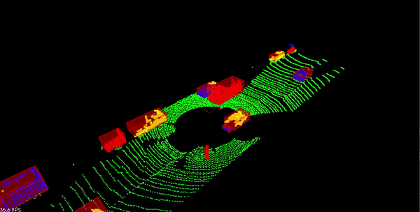

# Lidar Obstacle Detection 

```sh
			The main goal of the project is to filter, segment, and cluster 
			real point cloud data to detect obstacles in a driving environment. 
```


<p align=center>
	
</p>
